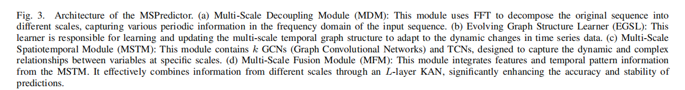

## MSPredictor: A Multi-Scale Dynamic Graph Neural Network for Multivariate Time Series Prediction

### Abstract

> *In the field of multivariate time series forecasting, capturing the dynamic relationships and complex cyclical patterns between sequences is key to improving prediction accuracy. To address this challenge, our paper introduces MSPredictor, a multi-scale dynamic graph neural network model, which uses Fast Fourier Transform for multi-scale decoupling in the frequency domain and employs Kolmogorov-Arnold Networks for multi-scale fusion, effectively extracting significant cyclical patterns. By decomposing the original series across different scales, MSPredictor accurately models complex cyclical patterns. To enhance the model's transparency and interpretability, we introduced the ClarityLens explanatory strategy, which employs visualization techniques to make the prediction process more transparent. Specifically, it displays the adjacency matrices learned at different scales, intuitively showing the dynamic correlations between series. We also visualized the proportion of different periods in the prediction results and the specific forecasting performance at each time scale. Extensive testing on multiple real-world datasets has demonstrated that the MSPredictor significantly outperforms existing benchmarks, validating its practicality and high transparency. Code is available at https://github.com/wanjiashan/MSPredictor**

Index Terms—Multivariate Time Series, Graph Neural Networks, Multi-Scale Analysis, Kolmogorov-Arnold Networks, Explainable AI.

## 1.Introduction

  

  

Challenge 1: Incompleteness in multi-scale modeling. Existing models often use a fixed time resolution, which limits their ability to capture dependencies at different time scales (As shown in the upper part of Fig.2). For example, in traffic data analysis, traffic flows during different periods (such as all-day, half-day, and rush hours) exhibit multi-periodic features, highlighting the limitations of a single time resolution in capturing these varied periodic patterns.
Challenge 2: Limitations of the static graph structure assumption (As shown in the top-left part of Fig.2). This assumption restricts the model's ability to capture dynamically changing temporal patterns . Traditional GNNs often overlook the interactions between nodes that occur due to temporal changes, making static graph structures poorly suited for adapting to and explaining dynamic temporal variations. This may result in GNNs failing to capture and respond to critical time series changes effectively.
Challenge 3: Lack of explainability in prediction results. Although GNNs can process complex graph structure data and predict future states, the decision-making process of the model is often not transparent. In MTS prediction, the absence of intuitive visualization methods and clear logical expression makes it challenging to interpret model outputs.

To address the challenges in MTS prediction, We propose MSPredictor, a multi-scale dynamic graph neural network, designed to reveal the dynamics and complex temporal patterns in MTS data. Initially, we use Fast Fourier Transform (FFT) to decompose the original time series into key scales. Subsequently, through a dynamic graph structure learner in an end-to-end framework, we automatically identify specific scale graph structures and deeply analyze the complex dependencies between variables at different scales. We also introduce multi-scale temporal graphs to accurately model the correlations between variables in each period and design a multi-scale fusion module that integrates information across scales through the Kolmogorov-Arnold Networks (KANs). To enhance the explainability of model predictions, we developed an explanatory strategy called ClarityLens.

  

Loss trend comparison between TFPredictor and other benchmark models at different epoch counts
provides a detailed comparison of loss trends with increasing epochs under different architectures. From the analysis, it is evident that the Mamba model has significant advantages over Transformer-based models. To quantify the performance advantages of the ScaKAN component in the model further, we present the loss trends for MLP and ScaKAN in our model in Fig.ScaKAN outperforms MLP, with the 4-layer KAN structure performing the best. Its loss decreases rapidly to the minimum level after relatively few epochs and remains stable. This indicates that ScaKAN not only provides more accurate prediction results but also maintains consistency under different traffic conditions, which is crucial for real-world traffic prediction scenarios.
We design a model with linear time ${\cal O}\left( n \right)$ complexity, which not only improves prediction accuracy but also effectively shortens inference time, reduces computational costs, and enhances the model's practicality and scalability.

## 2. Training Procedure
### (1) Datasets

  

To evaluate the performance of MSPredictor in long-range time series forecasting, we conducted experiments on seven benchmark datasets: ETTm1, ETTm2, Electricity, Exchange-Rate, Traffic, Weather, Solar-Energy. For short-range time series forecasting, we selected the PEMS datasets and the Influenza-like Illness (ILI) dataset.

## 3.Experimental Results

  

  

To demonstrate the predictive capability of multi-scale
sequences, we not only performed a visual comparison of
our model’s predictions with those of other models but also
conducted a qualitative comparison of results across scales.
Fig. 11(a) displays the prediction results of MSPredictor,
accurately reflecting future trends and cyclical dynamics across
multiple scales. The depicted peaks and troughs in the figure
align closely with the actual data. In contrast, Fig. 11(b)
to 11(e) show the prediction results of other models, which
exhibit significant performance declines during specific time
periods. This decline is likely due to architectural limitations in
recognizing multi-scale patterns, sudden changes, and complex
intra- and inter-series correlations, causing them to be unable
to accurately follow these variations.
Further, Fig. 11(f) to 11(j) detail the predictive performance
at fixed scales. Specifically, the fine-scale predictions—shown
in Fig. 11(f) to 11(h)—highlight detailed variations in the
time series and precisely capture seasonal patterns. In contrast, the coarse-scale predictions—shown in Fig. 11(i) to
11(j)—emphasize the understanding of macro trends, demonstrating a broader grasp of trend dynamics at larger scales.
This comparison not only proves the superiority of our model
in multi-scale prediction but also emphasizes the importance
of multi-scale analysis in understanding complex time series
data.

## 4. Conclusion
  This study successfully developed a multi-scale dynamic graph neural network model called MSPredictor, designed to optimize MTS prediction. By innovatively designing an EGSL, this model constructs multi-scale dynamic graph adjacency matrices, effectively capturing dynamic inter-variable correlations across scales. Additionally, we introduced an MFM, which integrates data from various scales, significantly
enhancing the stability and accuracy of predictions.
Extensive experiments demonstrated that our model outperforms existing benchmark models across multiple realworld datasets, consistently outperforming existing benchmark
models. To enhance the model’s interpretability, we introduced
an explanatory strategy called ClarityLens, which visualizes
adjacency matrices and prediction outcomes at different time
scales, thereby showcasing the model’s internal reasoning process. This strategy not only increases the transparency of the
model but also offers a new perspective on the interpretability
of time series predictions. Despite the MSPredictor’s impressive performance in many respects, it has limitations, such as
potentially overemphasizing the relationships between nodes
while neglecting the holistic modeling of data changes over
time. Future research will explore the use of SSMs, treating
spatiotemporal dynamic graphs as an integrated system to
delve deeper into the dynamics of states over time, aiming
to overcome these limitations.
