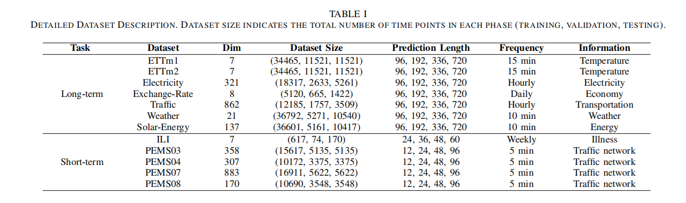

## MSPredictor: A Multi-Scale Dynamic Graph Neural Network for Multivariate Time Series Prediction

### Abstract

> *In the field of multivariate time series forecasting, capturing the dynamic relationships and complex cyclical patterns between sequences is key to improving prediction accuracy. To address this challenge, our paper introduces MSPredictor, a multi-scale dynamic graph neural network model, which uses Fast Fourier Transform for multi-scale decoupling in the frequency domain and employs Kolmogorov-Arnold Networks for multi-scale fusion, effectively extracting significant cyclical patterns. By decomposing the original series across different scales, MSPredictor accurately models complex cyclical patterns. To enhance the model's transparency and interpretability, we introduced the ClarityLens explanatory strategy, which employs visualization techniques to make the prediction process more transparent. Specifically, it displays the adjacency matrices learned at different scales, intuitively showing the dynamic correlations between series. We also visualized the proportion of different periods in the prediction results and the specific forecasting performance at each time scale. Extensive testing on multiple real-world datasets has demonstrated that the MSPredictor significantly outperforms existing benchmarks, validating its practicality and high transparency. Code is available at https://github.com/wanjiashan/MSPredictor**

Index Terms—Multivariate Time Series, Graph Neural Networks, Multi-Scale Analysis, Kolmogorov-Arnold Networks, Explainable AI.

## 1.Introduction
<div align="center">
  
</div>

Challenge 1: Incompleteness in multi-scale modeling. Existing models often use a fixed time resolution, which limits their ability to capture dependencies at different time scales (As shown in the upper part of Fig.2). For example, in traffic data analysis, traffic flows during different periods (such as all-day, half-day, and rush hours) exhibit multi-periodic features, highlighting the limitations of a single time resolution in capturing these varied periodic patterns.
Challenge 2: Limitations of the static graph structure assumption (As shown in the top-left part of Fig.2). This assumption restricts the model's ability to capture dynamically changing temporal patterns . Traditional GNNs often overlook the interactions between nodes that occur due to temporal changes, making static graph structures poorly suited for adapting to and explaining dynamic temporal variations. This may result in GNNs failing to capture and respond to critical time series changes effectively.
Challenge 3: Lack of explainability in prediction results. Although GNNs can process complex graph structure data and predict future states, the decision-making process of the model is often not transparent. In MTS prediction, the absence of intuitive visualization methods and clear logical expression makes it challenging to interpret model outputs.

To address the challenges in MTS prediction, We propose MSPredictor, a multi-scale dynamic graph neural network, designed to reveal the dynamics and complex temporal patterns in MTS data. Initially, we use Fast Fourier Transform (FFT) to decompose the original time series into key scales. Subsequently, through a dynamic graph structure learner in an end-to-end framework, we automatically identify specific scale graph structures and deeply analyze the complex dependencies between variables at different scales. We also introduce multi-scale temporal graphs to accurately model the correlations between variables in each period and design a multi-scale fusion module that integrates information across scales through the Kolmogorov-Arnold Networks (KANs). To enhance the explainability of model predictions, we developed an explanatory strategy called ClarityLens.
<div align="center">
  
</div>


Loss trend comparison between TFPredictor and other benchmark models at different epoch counts
provides a detailed comparison of loss trends with increasing epochs under different architectures. From the analysis, it is evident that the Mamba model has significant advantages over Transformer-based models. To quantify the performance advantages of the ScaKAN component in the model further, we present the loss trends for MLP and ScaKAN in our model in Fig.ScaKAN outperforms MLP, with the 4-layer KAN structure performing the best. Its loss decreases rapidly to the minimum level after relatively few epochs and remains stable. This indicates that ScaKAN not only provides more accurate prediction results but also maintains consistency under different traffic conditions, which is crucial for real-world traffic prediction scenarios.
We design a model with linear time ${\cal O}\left( n \right)$ complexity, which not only improves prediction accuracy but also effectively shortens inference time, reduces computational costs, and enhances the model's practicality and scalability.

## 2. Training Procedure
### (1) Datasets

We evaluate the performance of TFPredictor on six major
traffic flow prediction benchmark datasets: METR-LA, PEMS-BAY, PEMS03, PEMS04, PEMS07, and PEMS08. The time
interval for each dataset is 5 minutes, resulting in 12 time
frames per hour. These datasets are widely used in traffic
prediction research and cover various traffic conditions and
challenges. For more information about these datasets, please
refer to Table I.


<b>PEMS04</b>: A benchmark in spatiotemporal data mining & traffic forecasting. [Data Source](link)

<b>METR-LA</b>:Traffic data from 207 sensors in Los Angeles highways. [Data Source](https://github.com/laekov/Traffic-Data).

<b>PEMS-BAY</b>: Traffic data from 325 sensors across the Bay Area, California. [Data Source](link).


### (2) Network Parameter Tuning
To evaluate the performance of MSPredictor in long-range time series forecasting, we conducted experiments on seven benchmark datasets: ETTm1, ETTm2, Electricity, Exchange-Rate, Traffic, Weather, Solar-Energy. For short-range time series forecasting, we selected the PEMS datasets and the Influenza-like Illness (ILI) dataset.


### (3) Benchmarks Models
We train benchmark models such as <a href="https://github.com/LincanLi98/STG-Mamba" target="_blank">STG-Mamba</a>, <a href="https://github.com/XDZhelheim/STAEformer" target="_blank">STAEformer</a>, <a href="https://github.com/BUAABIGSCity/PDFormer" target="_blank">PDFormer</a>, <a href="https://github.com/chnsh/DCRNN_PyTorch" target="_blank">DCRNN</a>, <a href="https://github.com/hazdzz/STGCN" target="_blank">STGCN</a>, <a href="https://github.com/nnzhan/MTGNN" target="_blank">MTGNN</a>, <a href="https://github.com/zhengchuanpan/GMAN" target="_blank">GMAN</a>, ,<a href="https://github.com/LiuAoyu1998/STIDGCN" target="_blank">STIDGCN</a>, <a href="https://github.com/wengwenchao123/DDGCRN" target="_blank">DDGCRN</a> ,<a href="https://github.com/LeiBAI/AGCRN" target="_blank">AGCRN</a>, and <a href="https://github.com/nnzhan/Graph-WaveNet" target="_blank">Graph-WaveNet</a> based on the same sample set.

## 3.Experimental Results
<div align="center">
  
</div>
<div align="center">
  
</div>
```
## 4. Conclusion
  In this paper, we explored the multi-scale Selective State Space Model, TFPredictor, in detail and evaluated its effectiveness in handling spatiotemporal data, particularly in critical traffic flow prediction tasks, where the model can effectively model and predict sequence data. By introducing KFGNN, TFPredictor achieves dynamic evolution of the spatiotemporal graph adjacency matrix, which is closely integrated with the SSSM process of the entire graph. Additionally, we introduced the Graph-Mamba block, a module designed based on the SSSM to optimize graph data processing. Using the ScaKAN architecture for the multi-scale fusion module, TFPredictor ensures effective cross-scale correlation capture, improving the accuracy and robustness of multi-scale representations. Compared to attention-based methods, TFPredictor significantly reduces inference time while maintaining linear time complexity.
Extensive empirical studies conducted on multiple traffic datasets demonstrate that TFPredictor outperforms other benchmark methods in both prediction performance and computational efficiency. Furthermore, we performed an in-depth interpretability analysis on the PEMS-BAY and METR-LA datasets, showcasing the interpretative capability of the TFPredictor model.
Future research will delve deeper into the interpretability of the ScaKAN component in the TFPredictor model, focusing on identifying the impact of traffic patterns at different time scales on traffic flow. Advances in this area are expected to enhance the accuracy and reliability of traffic flow prediction models significantly, promoting more precise traffic management and planning applications.
